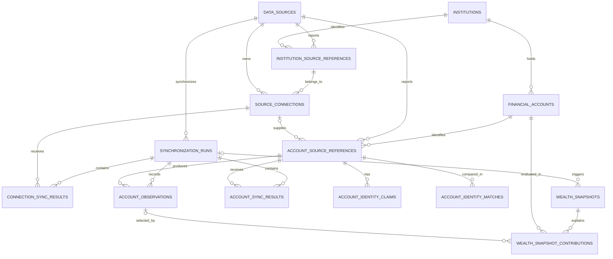

# Financial persistence foundation

## Purpose

This document explains the first persisted financial model: what was added,
how its tables relate, where the corresponding code lives, and how to extend it
with another data provider.

The canonical product behavior remains in [Product definition](product.md), and
the durable architectural rules remain in
[Domain and engineering principles](domain-and-engineering.md). This document
describes the current implementation of those decisions.

## What changed

The initial placeholder database table was replaced by a provider-neutral
financial foundation that can:

- map provider-owned identifiers to Monii-owned institutions and accounts;
- synchronize each provider connection independently;
- retain immutable account observations and synchronization outcomes;
- calculate current wealth from exact EUR account-level values;
- preserve the last valid value when a later refresh fails; and
- deduplicate strongly identified account references while retaining their
  provenance; and
- record an auditable snapshot of every contribution, exclusion, and duplicate
  adjustment decision.

Powens is the first adapter, but no Powens response type or identifier is used as
a domain identity. Provider payloads are normalized before they reach the
application and persistence model.

The schema intentionally does **not** store raw provider JSON or JSONB. Stable,
queried domain facts have typed relational columns. This keeps provider formats
out of business logic, makes constraints and nullability explicit, and avoids a
second provider-specific model hidden inside the database. If raw payload replay
is later required, it should use a separate access-controlled and time-bounded
integration store.

## Data model at a glance



There are three distinct layers in the model:

1. **Canonical domain objects** — institutions and financial accounts have
   Monii UUIDs and remain independent from any provider.
2. **Source identity and synchronization** — source references, connections,
   runs, results, and observations describe where data came from and what
   happened while retrieving it.
3. **Wealth read model and audit trail** — snapshots persist the known total and
   the decision made for every account at a specific time.

Historical records use restrictive foreign keys. Domain objects and source
connections are archived instead of being cascade-deleted, preserving the
provenance of observations and snapshots.

## Tables and relationships

### Source and institution identity

#### `data_sources`

Represents an integration or import mechanism, not a bank. Its internal UUID is
referenced throughout the schema. `key` is a stable unique application key such
as `powens`; `kind` and `display_name` describe the source. The optional
`external_subject_id` prevents a configured source from silently switching to a
different provider-side user.

#### `institutions`

Represents a canonical bank, broker, or other account-holding organization.
The identity belongs to Monii and is not derived from a provider ID or name.

#### `institution_source_references`

Maps a source-scoped external institution ID to one canonical institution. The
pair `(data_source_id, external_id)` is unique. Source-provided names and
first/last-seen timestamps retain useful provenance without making the source
record canonical.

A reference from a second provider can later be deliberately linked to an
existing institution. Name matching does not perform that merge automatically.

### Connections and accounts

#### `source_connections`

Represents one provider connection, with a Monii UUID and a source-scoped unique
external ID. It points to the institution reference reported for that
connection and can be archived without deleting its history.

#### `financial_accounts`

Represents the canonical account or financial container. Important policy
columns are:

- `kind`: `cash`, `investment`, `unsupported`, or `unknown`;
- `usage`: `private`, `professional`, or `unknown`; and
- `wealth_inclusion`: `automatic`, `include`, or `exclude`.

`automatic` applies the normal product rules. Explicit `include` and `exclude`
are operator decisions. Account metadata is deliberately small: sensitive bank
credentials, IBANs, and account numbers are not persisted.

#### `account_source_references`

Maps `(data_source_id, external_id)` to a canonical financial account and,
where applicable, a connection. It retains the provider's display name and type
alongside normalized lifecycle state:

- `active` can be eligible to contribute;
- `disabled` and `deleted` are excluded automatically; and
- `unknown` preserves uncertainty instead of inventing a state.

Every healthy source reference linked to a canonical account is eligible. The
newest healthy account-level observation supplies its value; failed observations
never displace the latest successful one.

#### `account_identity_claims` and `account_identity_matches`

Claims store only versioned HMAC fingerprints for validated IBAN, account
number, and normalized original-name evidence. Matches retain confirmed and
likely duplicate pairs, their evidence, activity, and later conflicts. Strong
matches merge references into the oldest canonical account and archive the
redundant account row. Likely matches remain separate and review-ready.

### Synchronization history

#### `synchronization_runs`

Records a whole source synchronization. Its status is `running`, `succeeded`,
`partial`, or `failed`. It includes an operation action ID, timestamps, and only
sanitized error kind/code fields. A partial run means at least one connection
failed while others remained useful.

#### `connection_sync_results`

Records the outcome for each connection in a run. The `(synchronization_run_id,
source_connection_id)` pair is unique. Provider update/state metadata and
sanitized errors make connection-level freshness and failure visible without
storing raw responses.

#### `account_sync_results` and `account_observations`

An account result records every identifiable account attempt as `succeeded`,
`provider_error`, `malformed`, or `not_seen`. Only a successful result links to
an observation. This keeps synchronization health separate from usable
financial history and permits account-specific fallback.

Stores one immutable normalized reading for an account source reference in a
run. It distinguishes:

- `retrieved_at`, when Monii received the data;
- `source_valid_at`, when the source says it was valid;
- source lifecycle and source error state;
- currency; and
- nullable `balance` and `estimated_value` candidates.

Money uses PostgreSQL `numeric(24, 8)`, not floating point. Missing values remain
`NULL`; unknown never becomes zero. The unique run/reference pair prevents the
same source account from being observed twice in one synchronization.

Observations retain both account-level candidates because account kind decides
which is usable: cash accounts use `balance`, investment accounts use
`estimated_value`. Investment balances and position totals are not fallbacks.

### Wealth history and explanation

#### `wealth_snapshots`

Records the result of a wealth calculation after a synchronization or inclusion
change. It contains the inclusive exact EUR headline, a candidate-adjusted
estimate, completeness, unresolved duplicate count, account counts, trigger,
optional synchronization run, and recording time.

A snapshot is a record of what Monii knew and decided at that moment. It is not
recomputed when newer observations arrive.

#### `wealth_snapshot_contributions`

Contains one row per account evaluated in a snapshot. Each row records:

- the contribution or exclusion decision;
- the selected value basis (`balance` or `estimated_value`);
- the exact contributed amount, when any;
- the latest observation available for diagnostic context; and
- the observation whose value was actually selected.

Possible decisions distinguish contribution from explicit exclusion, automatic
professional/lifecycle exclusion, missing values, unsupported or unknown account
kinds, non-EUR values, and other non-contributing states. A database check
constraint requires a contributing row to have a selected observation, value
basis, and amount, while non-contributing rows cannot pretend to have them.

Keeping both observations and snapshot contributions is intentional:
observations answer “what did the source report?”, while contributions answer
“what did Monii count, and why?”.

## Synchronization and wealth flow

```text
Specific daily cron or operator command
  -> CLI composition root
  -> provider client
  -> provider adapter normalizes connections and accounts
  -> synchronization use case isolates each connection
  -> PostgreSQL repository persists identities, outcomes, and observations
  -> wealth calculator selects latest usable EUR values
  -> repository persists a snapshot and per-account decisions
```

The read path uses persisted normalized data and never calls Powens. During a
sync, each connection is processed independently so one failure does not discard
successful updates from other connections. A failed refresh also does not erase
an earlier valid observation or alter an account lifecycle merely because the
account was absent.

For the V1 total:

- an eligible cash account contributes its latest usable EUR `balance`;
- an eligible investment account contributes its latest usable EUR
  `estimated_value`;
- signed values are preserved, including negative balances;
- disabled, deleted, explicitly excluded, and automatically excluded
  professional accounts do not contribute;
- missing, non-EUR, unsupported, and unknown values do not contribute and can
  make the aggregate incomplete; and
- native non-EUR amounts remain visible with an `unsupported_currency`
  decision;
- likely duplicates remain in the headline while a second estimate keeps one
  representative per candidate group; and
- account values are never added to their underlying positions or cash again.

Freshness is evaluated separately from value selection. Values become stale
after 48 hours but remain usable and visibly stale. A newer failed connection
refresh is reported immediately while the last valid value remains available.

## Code organization

```text
apps/
  cli/src/index.ts                         process bootstrap
  cli/src/cli.ts                           oclif runner and operation context
  cli/src/commands/sync.ts                 sync metadata, parsing, exit status
  cli/src/operations/sync.ts               sync composition, reporting, cleanup

packages/
  wealth/src/
    account-identity.ts                   pure conservative identity policy
    synchronization.ts                    normalized outcomes, ports, orchestration
    wealth.ts                             wealth rules, exact decimal math, use cases
    index.ts                              public wealth exports

  server/src/
    database/schema.ts                    Drizzle table and constraint definitions
    powens/
      client.ts                           Powens HTTP transport
      endpoints/                          provider request/response DTOs
      source.ts                           Powens-to-wealth normalization adapter
    wealth/repository.ts                  PostgreSQL synchronization/wealth adapter

drizzle/
  0001_financial_foundation.sql           generated SQL migration
  0002_reliable_sync_identity.sql         sync reliability and identity upgrade
  meta/                                   Drizzle migration metadata

tests/
  wealth/wealth.test.ts                   framework-free business behavior
  wealth/wealth.integration.test.ts       PostgreSQL persistence and reconciliation
  powens/powens.test.ts                   endpoint and normalization behavior
```

The dependency direction is deliberate:

```text
CLI -> server adapters -> wealth rules and contracts
```

`packages/wealth` has no knowledge of Drizzle, PostgreSQL, Powens,
environment variables, or CLI execution. It owns provider-neutral inputs,
business decisions, exact fixed-scale decimal arithmetic, and interfaces for
external work. `packages/server` implements those interfaces at the database and
provider boundaries. The CLI only assembles concrete dependencies and starts a
sync.

The PostgreSQL repository performs reconciliation and persistence in
transactions. Per-connection transactions preserve successful work from other
connections, while immutable results, observations, and snapshots protect the
historical record.

## Adding another provider

A second source should normally require a new server-side adapter, not changes
to wealth calculation. The implementation sequence is:

1. Implement the wealth `FinancialSource` contract and normalize provider
   institution, connection, account, lifecycle, kind, usage, timestamps, and
   decimal values.
2. Keep provider DTOs, authentication, pagination, and error details inside the
   adapter boundary.
3. Register a stable `data_sources.key` and source-scoped external references.
4. Let the existing synchronization repository create or update canonical
   objects and immutable observations.
5. Reuse the opaque identity-evidence contract. Only the documented composite
   identity may auto-merge; labels may create candidates but never confirmation.
6. Add adapter tests for mapping and failure behavior. Reuse wealth
   tests unless the product semantics themselves change.

If a new provider exposes information that the normalized contract cannot
represent, first decide whether it is a durable domain fact, synchronization
metadata, or provider-only detail. Add a relational domain field only when the
application needs its meaning; do not add a generic JSONB escape hatch by
default.

## Migration and verification

The schema source is `packages/server/src/database/schema.ts`. Migration `0001`
creates the foundation; `0002` upgrades existing databases without rewriting
history, backfills account results and adjusted snapshot totals, and adds the
identity, merge, and finalization constraints. The next successful sync creates
the corrected current snapshot because raw identity inputs were intentionally
never stored for migration-time matching.

Useful verification commands are:

```bash
pnpm lint
pnpm typecheck
pnpm test:unit
pnpm test:integration
specific exec web -- pnpm db:migrate
```

Application infrastructure remains defined in `specific.hcl`. The database and
daily synchronization schedule did not require a new infrastructure model for
this foundation.

## Deliberately deferred

This foundation does not introduce holdings, instruments, transactions,
multi-currency conversion, an operator duplicate-review UI or mutation API,
multi-user tenancy, historical charts, or performance analytics. The retained
observations and provenance leave room for those capabilities without making
them part of V1.
